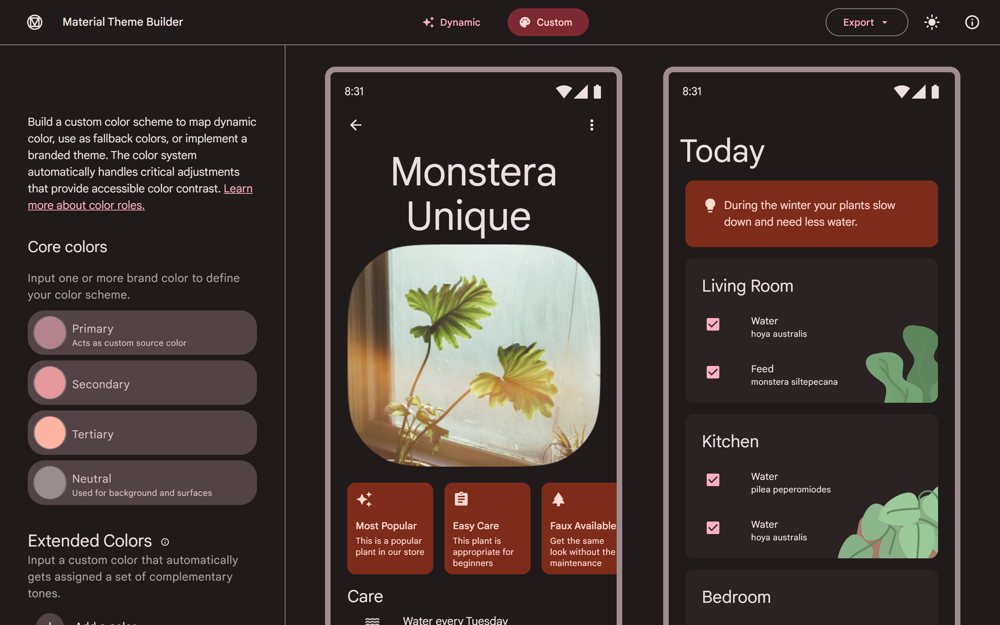
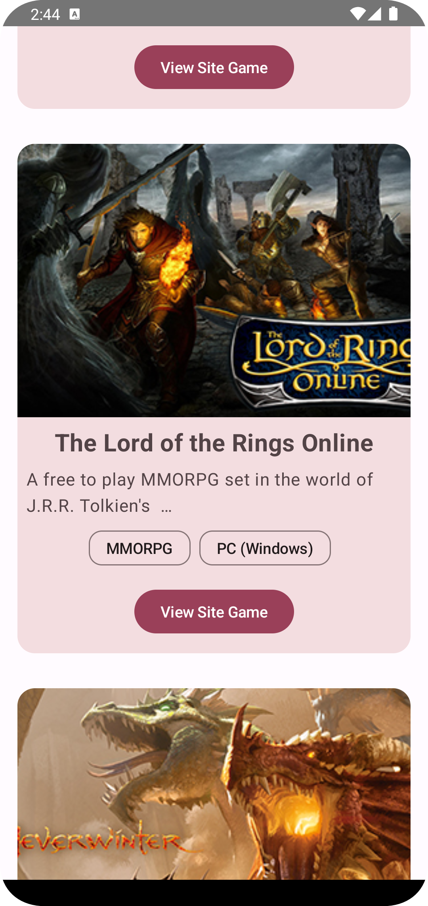
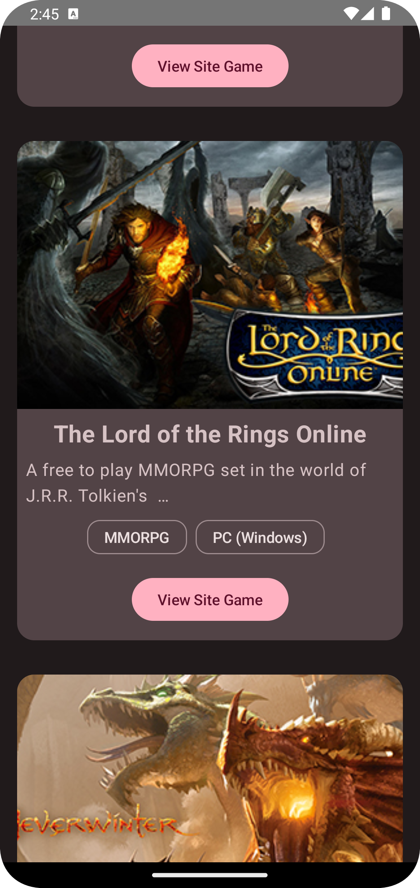

# ComposeTutorial 

La aplicación consume una API que proporciona información sobre juegos gratuitos disponibles en línea. El objetivo principal de la aplicación es proporcionar a los usuarios una forma sencilla de encontrar juegos interesantes y divertidos para jugar en sus dispositivos móviles.

## Funcionalidades y Características ✨

-   **Listado de Juegos:** La aplicación muestra un listado de juegos en la pantalla principal, cada uno representado por una tarjeta que incluye su título, una imagen en miniatura, una descripción breve y detalles adicionales como género y plataforma.
-   **Búsqueda y Descubrimiento:** Los usuarios pueden explorar una amplia variedad de juegos de diferentes géneros y plataformas para descubrir nuevos juegos interesantes.
-   **Interfaz de Usuario Moderna:** La aplicación utiliza Jetpack Compose y Material Design para ofrecer una interfaz de usuario moderna y atractiva.

## Tecnologías Utilizadas 🛠️

-   **Kotlin:** El lenguaje de programación principal utilizado para desarrollar la aplicación.
-   **Jetpack Compose:** La biblioteca de Android utilizada para crear la interfaz de usuario de manera declarativa y moderna.
-   **Retrofit:** Se utiliza para realizar solicitudes HTTP y consumir datos de la API.
-   **Dagger Hilt:** Se emplea para la inyección de dependencias y gestionar las dependencias de la aplicación.
-   **ViewModel:** Se utiliza para separar la lógica de presentación de la lógica de negocio.
-   **Coroutines:** Se utilizan para realizar operaciones asincrónicas de manera eficiente.

## Aprendizaje y Destrezas Adquiridas 🦾

Durante el desarrollo de este proyecto, se han adquirido conocimientos y habilidades en:

-   **Desarrollo en Jetpack Compose:** El proyecto ha proporcionado experiencia en la construcción de interfaces de usuario con Jetpack Compose, una tecnología relativamente nueva en el desarrollo de Android.
-   **Uso de Retrofit:** Se ha aprendido a utilizar Retrofit para realizar solicitudes a una API web y procesar los datos obtenidos.
-   **Inyección de Dependencias:** Se han adquirido habilidades en la configuración y uso de Dagger Hilt para la inyección de dependencias en Android.
-   **Manejo de ViewModels:** Se ha trabajado con ViewModels para separar la lógica de presentación de la lógica de negocio, lo que facilita la escalabilidad y la prueba de la aplicación.
-   **Trabajo con Coroutines:** Se han aplicado Coroutines para manejar operaciones asincrónicas de manera eficiente y segura en Android.

## Información de la API 🌐
**API Utilizada**
| Nombre         | Descripción                                                                      | API Url                         |
|----------------|----------------------------------------------------------------------------------|---------------------------------|
| FreeToGame API | Una API que proporciona información sobre juegos gratuitos disponibles en línea. | https://www.freetogame.com/api/ |

**Endpoint Llamado**
| Método | Endpoint | Descripción                            |
|--------|----------|----------------------------------------|
| GET    | /games | Obtiene una lista de juegos gratuitos. |

## Paleta de Colores 🎨

La paleta de colores de la aplicación ha sido diseñada con el Material 3 Design Theme Builder de Android. Aquí están los colores clave utilizados en la aplicación:

<div align="center">  </div>

-  **Primary:** `#b5838d`
    
-  **Secondary:** `#e5989b`
    
-  **Tertiary:** `#ffb4a2`
    
-  **Neutral:** `#988e8f`
    

Puedes explorar y personalizar aún más esta paleta utilizando el [Material 3 Design Theme Builder](https://m3.material.io/theme-builder#/custom).


## Capturas de Pantalla 🖼️

  

## Requisitos del Sistema 📔

Para ejecutar la aplicación ComposeTutorial en un dispositivo Android, debes cumplir con los siguientes requisitos del sistema:

-   Dispositivo Android con sistema operativo Android 5.0 (Lollipop) o superior.
-   Conexión a Internet para cargar datos de juegos desde la API.
-   Se recomienda un dispositivo con al menos 2 GB de RAM para un rendimiento óptimo.

### **Dependencias Gradle**

A continuación, se muestra una lista de las dependencias Gradle utilizadas en el proyecto FreeGames. Puedes agregar estas dependencias en tu archivo `build.gradle` para configurar el entorno de desarrollo y las bibliotecas necesarias:


```gradle
dependencies {
    // Jetpack Compose
    implementation("androidx.compose.ui:ui:1.5.1")
    implementation("androidx.compose.material3:material:1.1.2")
    implementation("androidx.activity:activity-compose:1.7.2")
    implementation("androidx.lifecycle:lifecycle-viewmodel-compose:2.6.2")
    
    // Retrofit y GSON para solicitudes HTTP
    implementation("com.squareup.retrofit2:retrofit:2.9.0")
    implementation("com.squareup.retrofit2:converter-gson:2.9.0")
    
    // Dagger Hilt para inyección de dependencias
    implementation("com.google.dagger:hilt-android:2.48.0")
    kapt("com.google.dagger:hilt-android-compiler:2.48.0")
    
    // Coil para cargar imágenes
    implementation("io.coil-kt:coil-compose:2.4.0")
}
``` 

Asegúrate de mantener actualizadas las versiones de estas dependencias según las últimas versiones disponibles en el momento de desarrollo. Además, es importante configurar Dagger Hilt y las anotaciones de inyección de dependencias correctamente en tu proyecto para que la inyección de dependencias funcione correctamente.

## Instalación y Uso 📥

1. Clona o descarga el repositorio en tu máquina local:

   ```shell
   git clone https://github.com/DaveDeveloper117/ComposeTutorial.git
   ``` 

2.  Abre el proyecto en Android Studio.
    
3.  Ejecuta la aplicación en un emulador de Android o dispositivo físico.

## Contribución 🤝

Las contribuciones son bienvenidas. Si deseas mejorar el proyecto o agregar funcionalidades adicionales, puedes hacer un fork del repositorio, realizar tus cambios y enviar una pull request.

## Licencia 🗝️

Este proyecto está licenciado bajo [MIT License](https://github.com/DaveDeveloper117/ComposeTutorial/blob/master/LICENSE).

## Contacto 📩

Si tienes alguna pregunta o sugerencia, no dudes en ponerte en contacto conmigo a través de mi dirección de correo electrónico: [dabicho803@gmail.com](mailto:dabicho803@gmail.com).
